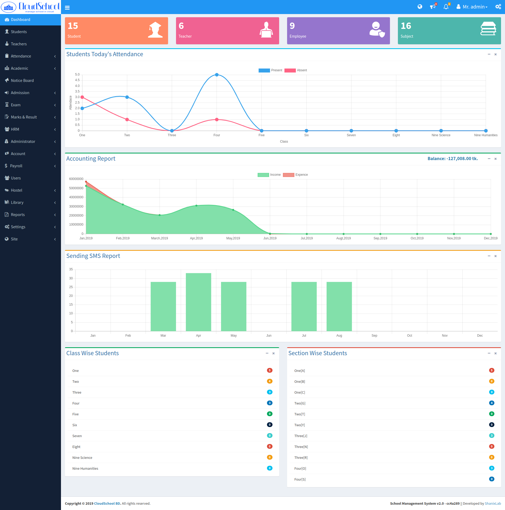
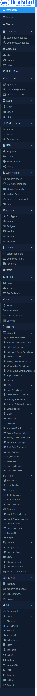
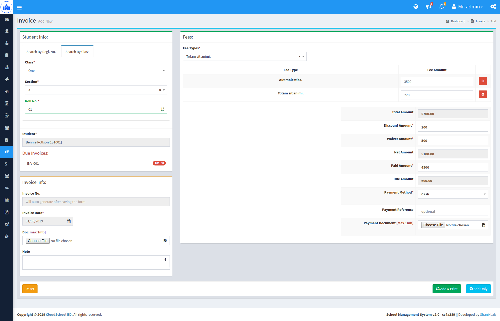

# School Management System (Enterprise Edition)
Another School Management System build with laravel and PHP 7.

# Features
- Academic Year manage
- Academic Calendar Setup
- Institute Setup
- Class & Section
- Subject & Teacher
- Student Admission
- Online Admission
- Student Attendance
- Exam & Grading Rules
- Makrs & Result
- Student Promotion
- Notice Board
- Employees Manage
- Employees Attendance
- Employees Leave
- Employees Work Outside
- SMS Gateway Setup 
- Attendance notification email/sms 
- Student & Employee Id-Card mass print with 
- Bulk Id Cards Print
- User & Role manage with permision grid(ACL)
- User wise Dashboard
- Account Manage
- Budget Manage
- Account Heads
- Student Invoice
- Income / Expense Manage
- Payroll 
- Salary Template
- Employee Salary Payment
- Hostel & Collection Manage
- Library Manage
- Issue book and fine collection
- Report Settings
- **40+ Reports**
- Academic Calendar Print
- Dynamic Front Website
- Website Management Panel
- Photo Gallery
- Event Manage
- Google Analytics
- User Notificateion
- More...

**Any query contact [dev@hrshadhin.me](mailto:dev@hrshadhin.me)**

**Demo(Enterprise Edition)**\
website url: http://cloudschoolbd.com \
app login: http://cloudschoolbd.com/login \
username: admin\
password: demo123

# Screenshot

# License

SMS EE is licensed under proprietary license. Frameworks and libraries has it own licensed
